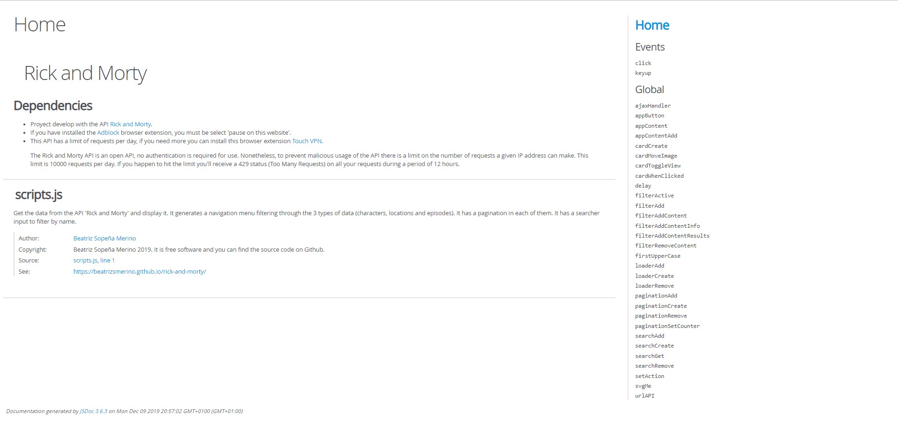

# Rick and Morty

[](https://beatrizsmerino.github.io/rick-and-morty/)

## 🎯 Description

This project fetches data from the [Rick and Morty API](https://rickandmortyapi.com/) and displays it in an interactive interface. It generates a navigation menu filtering through the 3 types of data (characters, locations and episodes). It has pagination in each of them and a search input to filter by name.

> **App**: [beatrizsmerino.github.io/rick-and-morty](https://beatrizsmerino.github.io/rick-and-morty/)
>
> **Documentation**: [beatrizsmerino.github.io/rick-and-morty/jsdocs](https://beatrizsmerino.github.io/rick-and-morty/jsdocs/index.html)

## 📂 Project Structure

```
rick-and-morty/
├── assets/
│   ├── css/          # Compiled CSS styles
│   ├── favicon/      # Favicon files
│   ├── icomoon/      # Icon fonts
│   ├── images/       # Project images
│   └── js/           # JavaScript files
│       └── scripts.js
├── jsdocs/           # JSDoc generated documentation
├── README/
│   └── images/       # README screenshots
├── .husky/           # Git hooks
├── jsdoc.json        # JSDoc configuration
└── package.json
```

## 🏗️ Developed with


[](https://sass-lang.com/)


[](https://jsdoc.app/)
[](https://typicode.github.io/husky/)
[](https://commitlint.js.org/)
[](https://www.conventionalcommits.org)

### API

#### Rate Limit

The Rick and Morty API is an open API, no authentication is required for use. Nonetheless, to prevent malicious usage of the API there is a limit on the number of requests a given IP address can make. This limit is 10000 requests per day. If you happen to hit the limit you'll receive a 429 status (Too Many Requests) on all your requests during a period of 12 hours.

```json
{
  "characters": "https://rickandmortyapi.com/api/character",
  "locations": "https://rickandmortyapi.com/api/location",
  "episodes": "https://rickandmortyapi.com/api/episode"
}
```

#### Adblock Extension

If you have installed the [Adblock](https://chrome.google.com/webstore/detail/adblock-%E2%80%94-best-ad-blocker/gighmmpiobklfepjocnamgkkbiglidom) browser extension, you must select 'pause on this website' for the app to work correctly.

#### VPN Extension

If you need more API requests, you can use a VPN browser extension to change your IP address.

### JSDoc

This project uses [JSDoc](https://jsdoc.app/) to generate documentation from the JavaScript source code comments.

The documentation is generated from `assets/js/scripts.js` and exported to the `jsdocs` folder. It is published on GitHub Pages and can be accessed at [beatrizsmerino.github.io/rick-and-morty/jsdocs](https://beatrizsmerino.github.io/rick-and-morty/jsdocs/index.html).

[](https://beatrizsmerino.github.io/rick-and-morty/jsdocs/index.html)

## 🚀 Commands

### Install dependencies

```bash
npm install
```

### Generate JSDoc documentation

```bash
npm run jsdocs
```

## 🤝 Contributing

This project uses [Husky](https://typicode.github.io/husky/) for Git hooks and [Commitlint](https://commitlint.js.org/) for commit message validation.

All commits must follow the [Conventional Commits](https://www.conventionalcommits.org/) specification:

```
type(scope): description
```

## 🔗 References

### API
- [Rick and Morty API](https://rickandmortyapi.com/)
- [Rick and Morty API Documentation](https://rickandmortyapi.com/documentation)

### Documentation
- [JSDoc](https://jsdoc.app/)
- [DevDocs - JSDoc](https://devdocs.io/jsdoc/)
